# Diagrammes UML detailles - Plateforme de Gestion des Stages

Ce document couvre les classes metier principales et les cas d'utilisation globaux du projet.

Sources analysees:
- `backend/app/modules/*/models.py`
- `backend/app/modules/*/router.py`
- `backend/app/main.py`
- `frontend/src/App.tsx`
- `frontend/src/api/endpoints.ts`

Les fichiers PlantUML exportables sont disponibles ici:
- `backend/docs/diagramme_classes_detaille.puml`
- `backend/docs/diagramme_cas_utilisation_detaille.puml`

## 1. Diagramme de classes metier

Le diagramme se concentre sur les entites persistantes SQLAlchemy. Les schemas Pydantic, services et composants React sont exclus pour garder une lecture UML claire.

```mermaid
classDiagram
direction LR

class Utilisateur {
  +int id
  +String nom
  +String prenom
  +String email
  +String motDePasse
  +RoleEnum role
  +Boolean actif
  +Boolean emailVerifie
  +DateTime dateCreation
  +DateTime dateModification
  +DateTime dernierLogin
}

class Stagiaire {
  +String matricule
  +TypeStageEnum type_stage
  +StatutStageEnum statut_stage
  +Date date_debut_stage
  +Date date_fin_stage
  +String etablissement
  +String niveau_etude
  +int encadreur_id
  +DateTime date_validation
  +int note_finale
}

class Encadreur {
  +String matricule
  +GradeEnum grade
  +DepartementEnum departement
  +Boolean actif_encadrement
  +Boolean is_active
  +int max_stagiaires
  +nb_stagiaires_actuels() int
  +peut_prendre_stagiaire() bool
}

class ResetMotDePasse {
  +int id
  +int utilisateur_id
  +String token
  +DateTime date_creation
  +Date date_expiration
  +Boolean utilisee
}

class DemandeStage {
  +int id
  +String nom
  +String prenom
  +String email
  +String telephone
  +String etablissement
  +String niveau_etude
  +String departement_souhaite
  +Date date_debut_souhaitee
  +Date date_fin_souhaitee
  +JSON competences
  +JSON tags
  +StatutDemandeEnum statut
  +int encadreur_id
  +DateTime created_at
}

class DemandeStageStatusHistory {
  +int id
  +int demande_id
  +String previous_status
  +String new_status
  +Text reason
  +int changed_by
  +DateTime changed_at
}

class Projet {
  +int id
  +String code_projet
  +String intitule
  +DepartementEnum departement
  +TypeStageEnum type_stage
  +Text description
  +Text objectifs
  +Text livrables
  +String fiche_pdf_path
  +int duree_semaines
  +int charge_hebdo
  +NiveauEnum niveau_requis
  +JSON competences
  +JSON tags
  +int complexite
  +int priorite
  +ProjetStatusEnum status
  +int nombre_max_stagiaires
  +int encadreur_id
  +DateTime created_at
  +DateTime updated_at
}

class PropositionProjet {
  +int id
  +int demande_id
  +int projet_id
  +String token
  +DateTime date_expiration
  +StatutPropositionEnum statut
  +DateTime date_choix
  +DateTime created_at
}

class ChoixProjet {
  +int id
  +int demande_id
  +int projet_id
  +DateTime date_choix
  +DateTime created_at
}

class Affectation {
  +int id
  +int demande_id
  +int projet_id
  +int encadreur_id
  +int stagiaire_id
  +StatutAffectationEnum statut
  +DateTime date_affectation
  +DateTime date_debut_prevue
  +DateTime date_fin_prevue
  +DateTime created_at
  +DateTime updated_at
}

class Stage {
  +int id
  +int demandestage_id
  +int stagiaire_id
  +int encadreur_id
  +int projet_id
  +Date date_debut
  +Date date_fin
  +StatutStageEnum statut_stage
  +String texte_objectif
}

class Task {
  +int id
  +String title
  +Text description
  +int stage_id
  +int projet_id
  +int created_by
  +taskStatusEnum status
  +taskPriorityEnum priority
  +DateTime deadline
  +DateTime created_at
  +DateTime updated_at
}

class Task_submission {
  +int id
  +int task_id
  +int stagiaire_id
  +Text content
  +String file_url
  +DateTime submitted_at
}

class Evaluation {
  +int id
  +int stagiaire_id
  +int projet_id
  +int encadreur_id
  +int note
  +Text commentaire
  +DateTime created_at
  +DateTime updated_at
}

class PlanningEvent {
  +int id
  +int encadreur_id
  +int stagiaire_id
  +String title
  +Text description
  +planningEventTypeEnum event_type
  +taskPriorityEnum priority
  +String attendee_name
  +String location
  +DateTime start_at
  +DateTime end_at
  +DateTime created_at
  +DateTime updated_at
}

class Document {
  +int id
  +int demande_id
  +int user_id
  +DocumentTypeEnum type
  +String file_path
  +DateTime created_at
}

class DocumentReview {
  +int id
  +int document_id
  +String status
  +Text comment
  +int reviewed_by
  +DateTime reviewed_at
}

class MessageInterne {
  +int id
  +int id_expediteur
  +int id_destinataire
  +String sujet
  +String contenu
  +DateTime date_envoi
  +Boolean lu
}

class Notification {
  +int id
  +int user_id
  +String title
  +Text message
  +String category
  +Text payload
  +DateTime created_at
  +DateTime read_at
}

class Attestation {
  +int id
  +int stagiaire_id
  +int stage_id
  +int created_by
  +String numero_attestation
  +String file_path
  +DateTime date_debut_stage
  +DateTime date_fin_stage
  +Text description
  +DateTime created_at
  +DateTime updated_at
}

class Statistiques {
  +int id
  +String periode
  +int nombreDemandes
  +int nbrStagesvalides
  +int nbrStagesencours
  +float taxeReussite
}

Utilisateur <|-- Stagiaire
Utilisateur <|-- Encadreur

Utilisateur "1" o-- "0..*" ResetMotDePasse : reset_tokens
Utilisateur "1" o-- "0..*" Document : documents
Utilisateur "1" --> "0..*" Notification : recoit
Utilisateur "1" --> "0..*" MessageInterne : expediteur
Utilisateur "1" --> "0..*" MessageInterne : destinataire
Utilisateur "1" --> "0..*" Attestation : cree
Utilisateur "1" --> "0..*" DocumentReview : revise

Encadreur "1" --> "0..*" Stagiaire : encadre
Encadreur "1" --> "0..*" DemandeStage : traite
Encadreur "1" --> "0..*" Projet : propose
Encadreur "1" --> "0..*" Affectation : affecte
Encadreur "1" --> "0..*" Stage : supervise
Encadreur "1" --> "0..*" Task : cree
Encadreur "1" --> "0..*" Evaluation : saisit
Encadreur "1" --> "0..*" PlanningEvent : planifie

DemandeStage "1" o-- "0..*" Document : contient
DemandeStage "1" o-- "0..*" DemandeStageStatusHistory : historique
DemandeStage "1" --> "0..*" PropositionProjet : propositions
DemandeStage "1" --> "0..*" ChoixProjet : choix
DemandeStage "1" --> "0..*" Affectation : affectations
DemandeStage "1" --> "0..1" Stage : devient

Projet "1" --> "0..*" PropositionProjet : propose
Projet "1" --> "0..*" ChoixProjet : choisi
Projet "1" --> "0..*" Affectation : affectations
Projet "1" --> "0..*" Stage : realise
Projet "1" o-- "0..*" Task : taches
Projet "1" o-- "0..*" Evaluation : evaluations

Stagiaire "1" --> "0..*" Affectation : affectations
Stagiaire "1" --> "0..*" Stage : stages
Stagiaire "1" --> "0..*" Task_submission : soumissions
Stagiaire "1" o-- "0..*" Evaluation : evaluations
Stagiaire "1" o-- "0..*" Attestation : attestations
Stagiaire "1" --> "0..*" PlanningEvent : participe

Stage "1" o-- "0..*" Task : taches
Stage "1" o-- "0..*" Attestation : attestations

Task "1" --> "0..*" Task_submission : soumissions
Document "1" --> "0..*" DocumentReview : reviews
```

### Enumerations principales

| Enum | Valeurs |
| --- | --- |
| `RoleEnum` | `ADMIN`, `ENCADREUR`, `STAGIAIRE` |
| `StatutDemandeEnum` | `EN_ATTENTE`, `EN_COURS`, `ACCEPTEE`, `REFUSEE` |
| `StatutStageEnum` | `EN_ATTENTE`, `EN_COURS`, `TERMINE`, `ANNULE` |
| `TypeStageEnum` | `PFE`, `INITIATION`, `PERFECTIONNEMENT` |
| `DepartementEnum` | `INFORMATIQUE`, `RESSOURCES_HUMAINES`, `FINANCES`, `EXPLOITATION`, `SUPPORT`, `ADMINISTRATION` |
| `ProjetStatusEnum` | `DISPONIBLE`, `AFFECTE`, `TERMINE` |
| `taskStatusEnum` | `todo`, `in_progress`, `done`, `validated` |
| `taskPriorityEnum` | `low`, `medium`, `high` |
| `planningEventTypeEnum` | `meeting`, `review`, `visit`, `deadline` |
| `DocumentTypeEnum` | `cv`, `lettre`, `convocation`, `RAPPORT_FINAL`, `ATTESTATION` |
| `StatutAffectationEnum` | `AFFECTEE`, `EN_COURS`, `COMPLETEE`, `ANNULEE` |
| `StatutPropositionEnum` | `EN_ATTENTE`, `CHOISI`, `EXPIRE` |

## 2. Diagramme de cas d'utilisation detaille

```mermaid
flowchart LR
  Candidat([Candidat externe])
  Admin([Administrateur])
  Encadreur([Encadreur])
  Stagiaire([Stagiaire])
  Email([Service email])
  Notif([Notifications internes])

  subgraph Public["Espace public"]
    UC_Landing((Consulter accueil))
    UC_Options((Consulter options candidature))
    UC_Candidature((Soumettre candidature))
    UC_UploadInit((Joindre CV et lettre))
    UC_Selection((Ouvrir lien tokenise))
    UC_Choix((Choisir projet propose))
  end

  subgraph Auth["Authentification"]
    UC_Login((Se connecter))
    UC_Me((Consulter session))
    UC_Refresh((Renouveler token))
    UC_Logout((Se deconnecter))
    UC_Forgot((Demander reset mot de passe))
    UC_Reset((Reinitialiser mot de passe))
    UC_ChangePwd((Changer mot de passe))
  end

  subgraph AdminSpace["Back-office administrateur"]
    UC_AdminDash((Consulter dashboard global))
    UC_Users((Gerer utilisateurs))
    UC_Demandes((Gerer candidatures))
    UC_DemandeStatus((Accepter refuser attendre rouvrir))
    UC_History((Consulter historique demande))
    UC_Encadreurs((Gerer encadreurs))
    UC_Projects((Gerer projets de stage))
    UC_ProjectPdf((Gerer fiche PDF projet))
    UC_Proposals((Proposer top projets))
    UC_Affectations((Gerer affectations))
    UC_Stages((Gerer stages))
    UC_Stagiaires((Gerer stagiaires))
    UC_DocReview((Lister valider documents))
    UC_Attestations((Generer attestations))
    UC_Stats((Consulter statistiques))
  end

  subgraph EncSpace["Espace encadreur"]
    UC_EncDash((Consulter overview encadreur))
    UC_MyInterns((Voir stagiaires encadres))
    UC_MyStages((Voir stages encadres))
    UC_CreateTask((Creer tache))
    UC_TaskFollow((Suivre taches))
    UC_ReviewTask((Reviser soumission))
    UC_ValidateTask((Valider tache))
    UC_Planning((Gerer planning))
    UC_Evaluate((Evaluer stagiaire))
    UC_EncDocs((Consulter documents))
    UC_EncMsg((Messagerie))
  end

  subgraph StagSpace["Espace stagiaire"]
    UC_Profile((Consulter modifier profil))
    UC_MyStage((Consulter stage et projet))
    UC_MyTasks((Voir mes taches))
    UC_UpdateTask((Mettre a jour statut tache))
    UC_SubmitTask((Soumettre travail))
    UC_MyDocs((Gerer mes documents))
    UC_Report((Deposer rapport final))
    UC_MyPlanning((Consulter planning))
    UC_MyEval((Consulter evaluations))
    UC_MyAtt((Consulter telecharger attestations))
    UC_StagMsg((Messagerie))
  end

  subgraph Cross["Transverse"]
    UC_Notifs((Consulter notifications))
    UC_ReadNotifs((Marquer notifications lues))
    UC_Download((Telecharger fichiers))
  end

  Candidat --> UC_Landing
  Candidat --> UC_Options
  Candidat --> UC_Candidature
  UC_Candidature --> UC_UploadInit
  Candidat --> UC_Selection
  UC_Selection --> UC_Choix

  Admin --> UC_Login
  Encadreur --> UC_Login
  Stagiaire --> UC_Login
  Admin --> UC_ChangePwd
  Encadreur --> UC_ChangePwd
  Stagiaire --> UC_ChangePwd
  Candidat --> UC_Forgot
  Admin --> UC_Logout
  Encadreur --> UC_Logout
  Stagiaire --> UC_Logout

  Admin --> UC_AdminDash
  Admin --> UC_Users
  Admin --> UC_Demandes
  UC_Demandes --> UC_DemandeStatus
  UC_Demandes --> UC_History
  Admin --> UC_Encadreurs
  Admin --> UC_Projects
  UC_Projects --> UC_ProjectPdf
  Admin --> UC_Proposals
  UC_Proposals --> UC_Selection
  Admin --> UC_Affectations
  Admin --> UC_Stages
  Admin --> UC_Stagiaires
  Admin --> UC_DocReview
  Admin --> UC_Attestations
  Admin --> UC_Stats

  Encadreur --> UC_EncDash
  Encadreur --> UC_MyInterns
  Encadreur --> UC_MyStages
  Encadreur --> UC_CreateTask
  Encadreur --> UC_TaskFollow
  UC_TaskFollow --> UC_ReviewTask
  UC_TaskFollow --> UC_ValidateTask
  Encadreur --> UC_Planning
  Encadreur --> UC_Evaluate
  Encadreur --> UC_EncDocs
  Encadreur --> UC_EncMsg

  Stagiaire --> UC_Profile
  Stagiaire --> UC_MyStage
  Stagiaire --> UC_MyTasks
  UC_MyTasks --> UC_UpdateTask
  UC_MyTasks --> UC_SubmitTask
  Stagiaire --> UC_MyDocs
  UC_MyDocs --> UC_Report
  Stagiaire --> UC_MyPlanning
  Stagiaire --> UC_MyEval
  Stagiaire --> UC_MyAtt
  Stagiaire --> UC_StagMsg

  Admin --> UC_Notifs
  Encadreur --> UC_Notifs
  Stagiaire --> UC_Notifs
  UC_Notifs --> UC_ReadNotifs
  Admin --> UC_Download
  Encadreur --> UC_Download
  Stagiaire --> UC_Download

  UC_Candidature --> Email
  UC_DemandeStatus --> Email
  UC_Proposals --> Email
  UC_Affectations --> Notif
  UC_CreateTask --> Notif
  UC_SubmitTask --> Notif
  UC_ReviewTask --> Notif
  UC_Evaluate --> Notif
  UC_Choix --> Notif
```

### Detail par acteur

| Acteur | Cas d'utilisation principaux |
| --- | --- |
| Candidat externe | Consulter accueil, remplir candidature, uploader CV/lettre, recevoir lien de selection, choisir un projet. |
| Administrateur | Gerer utilisateurs, encadreurs, projets, demandes, affectations, stages, stagiaires, documents, attestations et statistiques. |
| Encadreur | Voir ses stagiaires, suivre stages, creer/reviser/valider taches, gerer planning, envoyer messages, evaluer stagiaires, consulter documents. |
| Stagiaire | Voir stage/projet, executer taches, deposer livrables/rapport final, consulter planning/evaluations/attestations, messagerie, profil. |
| Services externes | Envoi email pour candidature, changement statut, selection projet; notifications internes pour affectation, taches, evaluations. |

### Correspondance modules backend

| Domaine | Prefix API | Modules |
| --- | --- | --- |
| Authentification | `/auth` | `auth`, `core/security.py` |
| Utilisateurs | `/utilisateur` | `utilisateur` |
| Candidatures | `/projets-stage` | `demande_stage`, `document`, `propositions_projets`, `choix_projet` |
| Projets | `/Project` | `projet_stage`, `matching` |
| Affectations | `/affectation` | `affectations` |
| Encadreurs | `/encadreur` | `encadreurs` |
| Stagiaires et stages | `/stagiaires`, `/Stages` | `stagiaires`, `stage` |
| Taches | `/tasks` | `tasks` |
| Planning | `/planning` | `planning` |
| Communication | `/communication` | `message_interne` |
| Evaluations | `/evaluations` | `evaluation` |
| Attestations | `/attestations` | `attestation` |
| Notifications | `/notifications` | `notifications` |
| Statistiques | `/statistiques` | `statistiques` |
